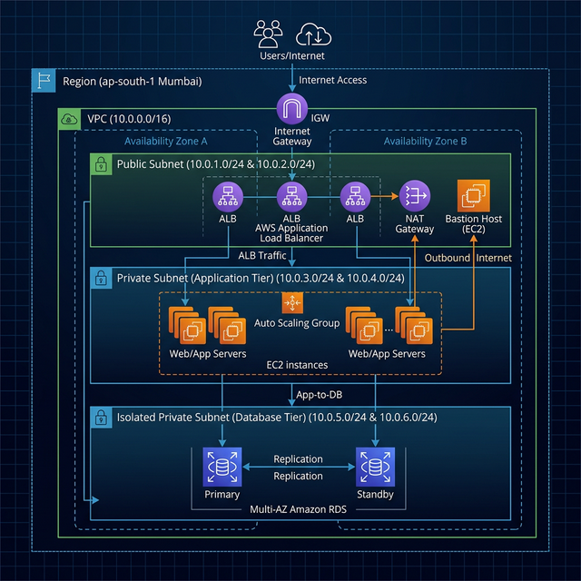

# ☁️ AWS VPC Secure Application Architecture

### _Production-Grade Multi-Tier Network Infrastructure with Terraform_

[](https://aws.amazon.com/)
[](https://www.terraform.io/)
[](https://opensource.org/licenses/MIT)

---

## 🚀 Project Overview

This repository showcases a **production-ready AWS Cloud Architecture** designed for high security, scalability, and tier-based isolation. Using **Infrastructure as Code (Terraform)**, this project automates the deployment of a robust Virtual Private Cloud (VPC) featuring isolated public and private subnets, ensuring that mission-critical data remains protected while maintaining seamless web accessibility.

### 🎯 Why This Project Matters?

In modern cloud engineering, security isn't just a feature—it's the foundation. This project demonstrates the ability to implement:

- **Zero Trust Principles**: Strict isolation of database tiers.
- **Automated Provisioning**: Scalable and repeatable infrastructure setup.
- **Cost-Optimized Connectivity**: Efficient traffic routing using NAT Gateways.

---

## 🏗️ Architecture Visualization



> **Architectural Logic**: Users access the web application through the Public Tier (App Server). The internal Application Logic then communicates with the Private Tier (DB Server) via a secure VPC backbone. The Database Tier has **no direct path** to or from the internet.

---

## 🛠️ Core Technical Skills Demonstrated

- **Cloud Networking**: VPC, Public/Private Subnets, IGW, NAT Gateways, Route Tables.
- **Infrastructure as Code (IaC)**: Terraform (Provisioning, State Management, Resource Dependency).
- **Security & Compliance**: Stateful Security Groups, Least Privilege IAM principles, Network Isolation.
- **Compute**: Automated EC2 Instance deployment with Amazon Linux 2.

---

## 🔐 Security-First Design

| Feature               | Implementation                                                                              |
| :-------------------- | :------------------------------------------------------------------------------------------ |
| **Network Isolation** | Private subnet contains no Public IP addresses.                                             |
| **Traffic Filtering** | Security Groups acting as stateful firewalls at the instance level.                         |
| **Access Control**    | Database port (3306) restricted **only** to the Application Security Group.                 |
| **Egress Policy**     | NAT Gateway allows private instances to download security updates without exposing ingress. |

---

## 🚀 Quick Start & Deployment

### 📋 Prerequisites

- [Terraform](https://www.terraform.io/downloads.html) v1.0+
- AWS CLI configured with `AdministratorAccess`
- A verified AWS Account

### ⚙️ Execution Commands

```bash
# 1. Clone the repository
git clone https://github.com/01Sachinc/aws-vpc-secure-architecture.git
cd aws-vpc-secure-architecture/terraform

# 2. Initialize the environment
terraform init

# 3. Validate & Plan
terraform plan

# 4. Deploy Infrastructure
terraform apply -auto-approve
```

---

## 📂 Project Structure

```text
aws-vpc-secure-architecture/
├── 📁 terraform/        # Modular IaC templates (.tf files)
├── 📁 architecture/     # High-res diagrams & flowcharts
├── 📁 docs/             # Technical deep-dives (Security, Network)
├── 📁 scripts/          # Automation (Deploy/Destroy)
└── 📁 img/              # Documentation assets
```

---

## 👨‍💻 Author

**Sachin C S**  
_AWS Cloud & DevOps Engineer | Infrastructure Automation Specialist_

[](https://www.linkedin.com/in/sachin-c-s/)
[](https://github.com/01Sachinc)

� **Email**: [cssachin83@gmail.com](mailto:cssachin83@gmail.com)  
📱 **Phone**: +91 8496001030

---

_Created with a focus on Best Practices & Professional Excellence._
